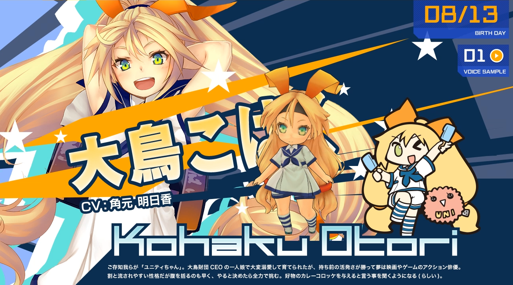
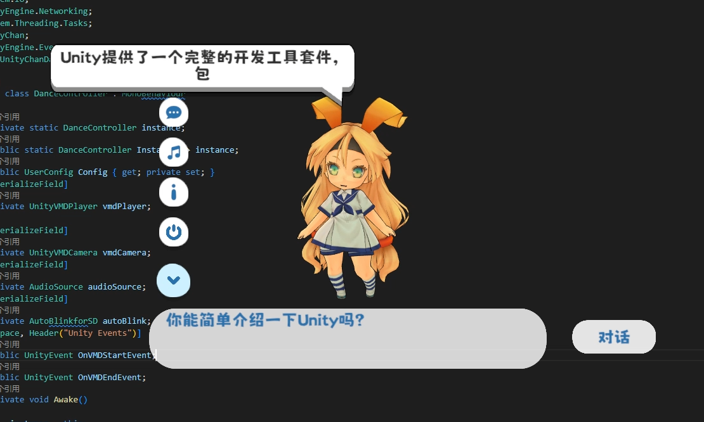

# UnityChanDesktop

链接：https://pan.baidu.com/s/1Im6-h4kru1O6Je_353dH7Q?pwd=2o2p 
提取码：2o2p 

## 对话功能说明：
1. 找到在Unity Chan Desktop_Data文件夹中的UserConfig.json
2. 在LLMType中填写使用的语言模型类别（’GPT‘为使用ChatGPT，需要输入自己的OpenAIKey，’GLM‘为本地部署的ChatGLM-6B，需填写相应的地址和端口）
3. 填写VITS的地址和端口，填写使用的角色语音模型序号
4. 根据需求修改初始的Prompt提示词

* 本地模型部署请查阅 https://github.com/AkiKurisu/VirtualHuman-Unity

## 跳舞功能说明：
1. 选择vmd Motion文件播放MMD舞蹈动作
2. 选择wav/mp3/oog/vag 音频文件播放MMD音乐（可选项）
3. 选择vmd Camera文件播放MMD相机动画（可选项，不推荐）
